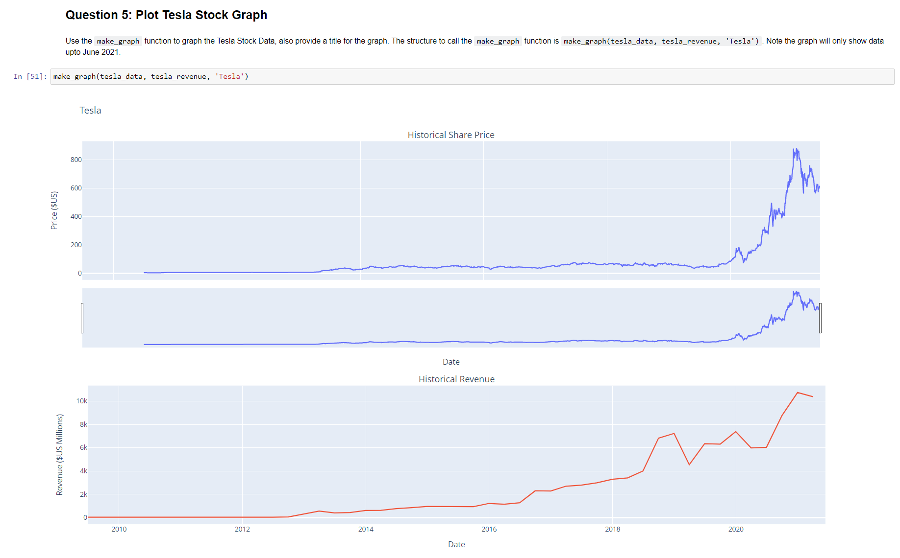
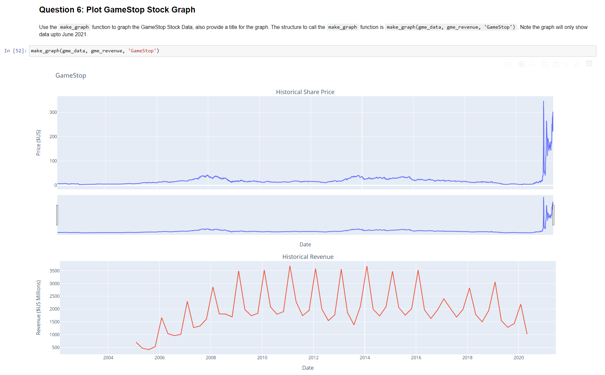

# Extracting-and-Visualizing-Stock-Data
Extracting essential data from a dataset and displaying it is a necessary part of data science; therefore individuals can make correct decisions based on the data. In this assignment, I will extract stock data from Tesla and GameStop, and will then display this data in a graph

## Historical Graph of Tesla Stocks 

## Historical Graph of GameStop Stocks

